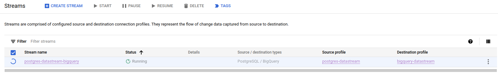
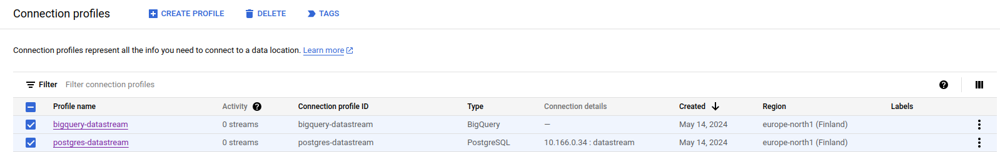

# Nada Datastream
Oppsett av datastream fra en cloudsql postgres database til bigquery.

## Binær utgivelse
[Nedlast binærfil](https://github.com/navikt/nada-datastream/releases)
 Vi tilbyr binær for mac og linux, mens for Windows-brukere, vennligst bruk Linux-delsystemet og den Linux-baserte binærfilen.

### Tillat binærfil fra uidentifisert utvikler på mac
Hvis du jobber på mac må du tillate at den usignerte binærfilen skal kunne kjøres ellers vil det blokkeres. Følg [denne](https://www.macworld.com/article/672947/how-to-open-a-mac-app-from-an-unidentified-developer.html) oppskriften for dette.

## Forutsetninger for bruk
Det er noen steg som må utføres på forhånd for å klargjøre postgres databasen for datastream. Først må man:

- Opprette en ny databasebruker som datastream koblingen skal bruke
- Databaseflagget `cloudsql.logical_decoding` må settes på for at man skal kunne bruke replication slots i databasen.

Disse to punktene løses enklest ved å editere nais manifestet til appen som eksemplifisert under:
````yaml
...
spec:
  gcp:
    sqlInstances:
    - name: myinstance
      flags:
      - name: cloudsql.logical_decoding # flagget som må settes
        value: "on" # flagget som må settes
      databases:
      - name: mydatabase
        users:
        - name: datastream # ekstra databasebruker
      diskAutoresize: true # Datastream bruker en del lagringsplass
... 
````

Videre må man legge til en databasemigrasjon som sørger for at den nyopprettede brukeren får tilgang til å lese de tabellene den er avhengig av for datastreamen. 
I eksempelet under er det gitt `select` tilgang for alle tabeller i `public` schema, men dette kan man spisse ytterligere dersom det er ønskelig.

Migrasjonen må også gi den nyopprettede brukeren `REPLICATION` rolle i databasen og lage en [publication og replication slot](https://cloud.google.com/datastream/docs/configure-your-source-postgresql-database#create_a_publication_and_a_replication_slot_2).
````sql
ALTER DEFAULT PRIVILEGES IN SCHEMA PUBLIC GRANT SELECT ON TABLES TO "datastream";
GRANT SELECT ON ALL TABLES IN SCHEMA PUBLIC TO "datastream";

ALTER USER "appnavn" WITH REPLICATION;
ALTER USER "datastream" WITH REPLICATION;
CREATE PUBLICATION "ds_publication" FOR ALL TABLES;
SELECT PG_CREATE_LOGICAL_REPLICATION_SLOT('ds_replication', 'pgoutput');
````
*Merk*: både appens bruker ("appnavn") og den nye brukeren trenger å oppdateres med `REPLICATION` rollen i databasen over

### Kjøre migrasjonen fra Flyway
Dersom man skal kjøre migrasjonen fra Flyway, så må man gjøre gjøre `pg_create_logical_replication_slot` i en egen transaksjon.
Ellers vil man få følgende feilmelding:
> cannot create logical replication slot in transaction that has performed writes

Eksempel på hvordan man kan gjøre det:
```sql
DO
$$
    BEGIN
        IF EXISTS(SELECT * FROM pg_roles WHERE rolname = 'datastream') THEN
            ALTER USER "appnavn" WITH REPLICATION;
            CREATE PUBLICATION "ds_publication" FOR ALL TABLES;

            ALTER DEFAULT PRIVILEGES IN SCHEMA PUBLIC GRANT SELECT ON TABLES TO "datastream";
            GRANT SELECT ON ALL TABLES IN SCHEMA PUBLIC TO "datastream";
            ALTER USER "datastream" WITH REPLICATION;
        END IF;
    END
$$ LANGUAGE 'plpgsql';

DO
$$
    BEGIN
        IF EXISTS(SELECT * FROM pg_roles WHERE rolname = 'datastream') THEN
            PERFORM PG_CREATE_LOGICAL_REPLICATION_SLOT('ds_replication', 'pgoutput');
        END IF;
    END
$$ LANGUAGE 'plpgsql';
```

## Sett opp datastream kobling
Anbefaler at brukeren som skal kjøre oppsettet gir seg midlertidig `Project Editor` rolle i prosjektet.
Dette gjøres i IAM under `Grant Access`: `Role` -> `Basic`-> `Editor`.

Oppsettet krever at man:
    - er koblet til naisdevice
    - har tilgang til clusteret og namespacet som appen kjører i
    - har kjørt `gcloud auth login --update-adc`

Det enkleste er at context (cluster og namespace) allerede er satt i terminalen. 
Det er også mulig å spesifisere dette som script-argumenter: `--context` og `--namespace`

For å sette opp datastream kjør så følgende:

````bash
./bin/nada-datastream create appnavn databasebruker
````
### Spesifisere tabeller
Dersom man ikke spesifiserer noe vil alle tabeller i public schema i databasen inkluderes i streamen. For å ekskludere enkelte tabeller bruk flagget `--exclude-tables` som tar en kommaseparert streng med tabellene man ønsker å utelate, f.eks.

````bash
./bin/nada-datastream create appnavn databasebruker --exclude-tables=tabell1,tabell2,tabell3
````
Tilsvarende kan du også *inkludere* tabeller: Bruk da flagget `--include-tables`.

Vi støtter kun inkludering eller eksludering av tabeller i datastream oppsettet, dersom begge flagg angis vil det være de inkluderte tabellene som gjelder og det som er angitt med `--exclude-tables` blir da ignorert.
### Spesifisering av kolonner
Vi støtter heller ikke spesifisering av kolonner for tabellene som datastreamen gjelder for. Dette kan riktignok enkelt settes opp manuelt gjennom [cloud console UIet](https://console.cloud.google.com/datastream/streams) etter at man har opprettet datastreamen. For å gjøre det gå til [datastream i cloud console](https://console.cloud.google.com/datastream/streams) -> Trykk inn på streamen -> `Edit` -> `Edit source configuration` -> `SELECT COLUMNS` for de inkluderte tabellene.

### Data freshness
Default vil datastream settes opp så endringer skal dukke opp i BiqQuery garantert innen 15 minutter. Dette kan konfigureres gjennom å sette `--dataFreshness`-flagget. Dette tar en verdi i sekunder, f.eks. `--dataFreshness 3600` for en time. En lavere verdi vil kunne gi økte kostnader. Tenk derfor gjerne igjennom hvor ferske data som trengs i BigQuery.

### Hjelp
For flagg se
```bash
./bin/nada-datastream create --help
```

NB! krever gcloud versjon høyere enn 412.0.0, oppdater med `gcloud components update`

## Fjerne datastream
Når man ikke lenger trenger datastream, så er det viktig å rydde opp, slik at ikke postgres bruker ressurser på å opprettholde replication slot og publication.

### Fjerne datastream

Gå til https://console.cloud.google.com/datastream/streams huk av og velg Delete.



Eller kjør tilsvarende kommandoer:
```shell
$ gcloud datastream streams list --location europe-north1
NAME                          STATE    SOURCE                                                                                DESTINATION                                                                           CREATE_TIME                     UPDATE_TIME
postgres-datastream-bigquery  RUNNING  projects/xxxx/locations/europe-north1/connectionProfiles/postgres-datastream  projects/xxxx/locations/europe-north1/connectionProfiles/bigquery-datastream  2024-05-14T12:20:52.617451721Z  2024-06-05T20:08:49.594245441Z

$ gcloud datastream streams delete --location europe-north1 postgres-datastream-bigquery
```

### Fjerne connection profiles

Gå til https://console.cloud.google.com/datastream/connection-profiles og velge profilene og trykke Delete


Eller kjør tilsvarende kommandoer:
```shell
$ gcloud datastream connection-profiles list --location europe-north1
DISPLAY_NAME                     ID                                                                                                 TYPE        CREATED
postgres-datastream              projects/nada-dev-db2e/locations/europe-north1/connectionProfiles/postgres-datastream              PostgreSQL  2024-05-14T12:19:45
bigquery-datastream              projects/nada-dev-db2e/locations/europe-north1/connectionProfiles/bigquery-datastream              BigQuery    2024-05-14T12:20:48

$ gcloud datastream connection-profiles delete --location europe-north1 postgres-datastream
$ gcloud datastream connection-profiles delete --location europe-north1 bigquery-datastream 
```

### Rydde i databasen
Som databaseowner:
```sql
DROP PUBLICATION "ds_publication";
SELECT PG_DROP_REPLICATION_SLOT('ds_replication');
```
### Slette databasebruker
Man har to muligheter for å fjerne databasebruker:
* Fjerne fra nais.yaml - Da vil databasebrukeren slettes fra kubernetes, men ligge igjen i databasen og man må ev. slette den selv.
* Fjerne ev. objekter som databasebrukeren eier i databasen, annotere sqluser i kubernetes og deretter fjerne fra nais.yaml - Da vil databasebrukeren slettes fra kubernetes og databasen.
```shell
kubectl annotate sqluser datastream cnrm.cloud.google.com/deletion-policy=none
```